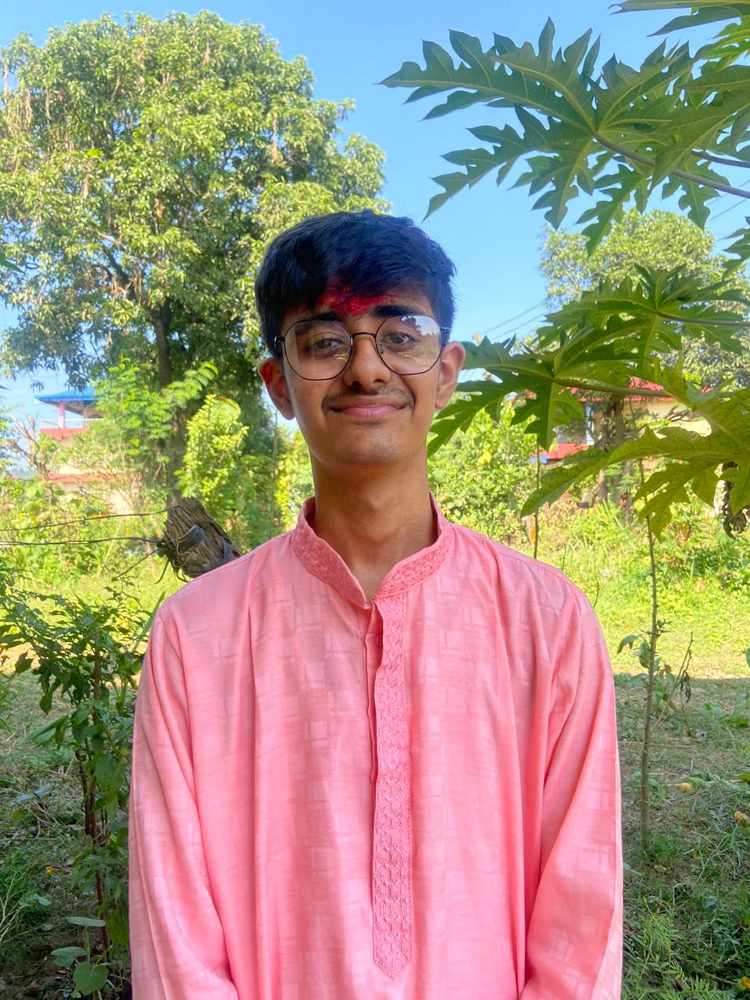
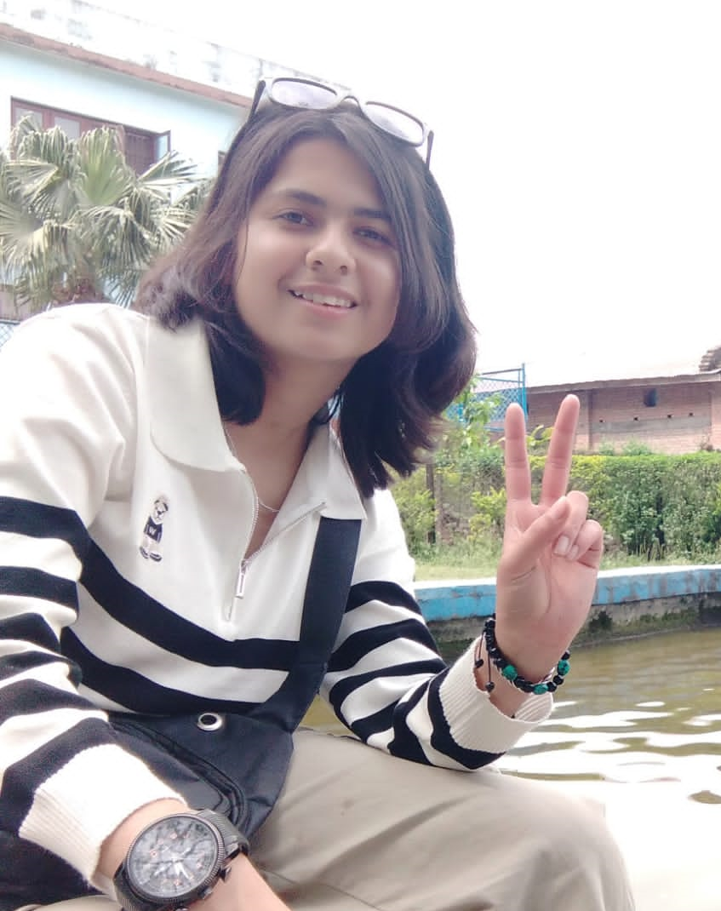
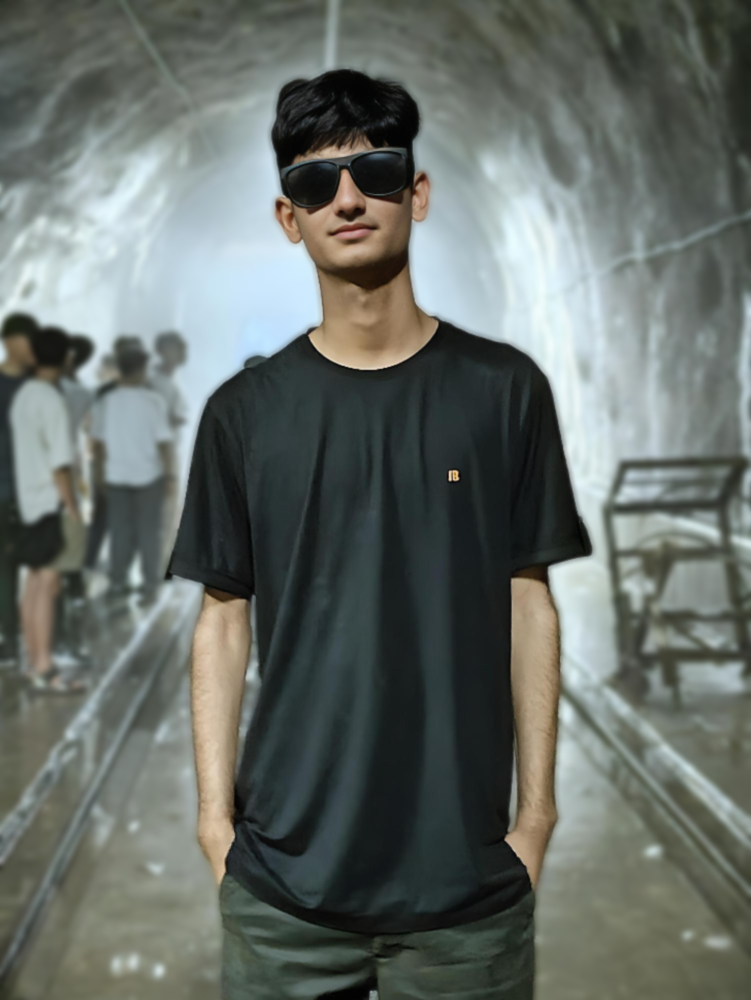
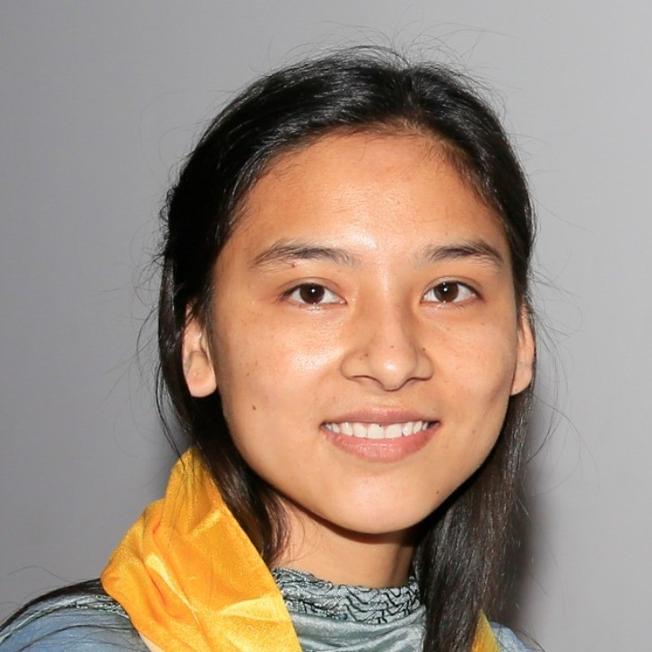

# NepaLingo

A website to learn the indigenous language of Nepal.

# Contributors

The contributors of this project are participants of Incubate Nepal.

# Mentors

## Christina Kayastha

<table>
    <tr>
        <td width=150>
            
        </td>
        <td>
            Christina Kayastha is a Principal Software Engineer with nearly a decade of industry experience. Originally from Nepal, she is currently working in Boston, USA as a Domain Architect leading innovation initiatives at Vista. Christina is an inventor on 11 patents, has given 50+ conference talks. In her free time, she loves nerding out about emerging tech, building interactive art installations, and is an active leader in her local cultural and tech communities.
        </td>
    </tr>
</table>

## Binam Kayastha

<table>
    <tr>
        <td width=150>
            
        </td>
        <td>
            Binam Kayastha is a Senior Software engineer with six years of industry experience. Originally from Nepal, he is currently working in Boston, USA as a Platform Engineer at Cirkul. Binam is a true full-stack developer with experience spanning DevOps, data engineering, back-end, and front-end. In his free time, he loves tinkering with new technologies, developing his own productivity apps, building games, and competing in hackathons.
        </td>
    </tr>
</table>

# Peer Mentor
## Hemanta Bhandari
<table>
    <tr>
        <td width=150>
            
        </td>
        <td>
            Hemanta (Hems) is a Budhanilkantha School alumnus with a passion for both mathematics and computer science, seamlessly blending theory with practical applications. He has a keen interest in applied mathematics and building full-stack web applications. In his free time, he enjoys playing chess and basketball, as well as expressing his creativity through sketching.
        </td>
    </tr>
</table>

# Mentees

## Saphal Upreti
<table>
    <tr>
        <td width=150>
            
        </td>
        <td>
            Saphal Upreti is an incoming freshman at Mississippi State University, double majoring in Computer Science and Business. His hobbies includes watching movies, gaming, occasionally listening and producing music and participating in hackathons. In his free time, he likes to work on different side projects and spend time with his friends and family. 
        </td>
    </tr>
</table>

## Sanskar Lamsal

<table>
    <tr>
        <td width=150>
            
        </td>
        <td>
            Sanskar Lamsal is a high school graduate. His hobbies include watching movies and TV series, participating in hackathons, and listening to music and podcasts. He has a keen interest in design and programming and enjoys creating things that matter. In his free time, he mostly hangs out with friends and family, works on side projects, or explores new interests.
        </td>
    </tr>
</table>

## Aanchal Nancy Jha

<table>
    <tr>
        <td width=150>
            
        </td>
        <td>
            Aanchal Nancy Jha is a high school graduate and a passionate coding enthusiast. She enjoys learning new programming languages, frameworks, and technologies. Her hobbies include creating mini-games and side projects, making coding tutorials on YouTube, reading tech blogs, and competing in hackathons. Nancy is always eager to learn and take on new challenges.
        </td>
    </tr>
</table>

## Puja Tajpuriya
<table>
    <tr>
        <td width=150>
            
        </td>
        <td>
            Puja Tajpuriya, a high school graduate with a deep passion for creativity and technology, is embarking on an exciting journey into programming. Alongside her hobbies of crafting poetry, singing melodies, and exploring zenart, she is passionately diving into the dynamic world of coding. she is committed to mastering programming fundamentals and leveraging her diverse interests to inspire unique projects. With a keen eye for detail and a natural flair for expression.
        </td>
    </tr>
</table>

## Aditya Bikram Thakur    
<table>
    <tr>
        <td width=150>
            
        </td>
        <td>
            Aditya Bikram Thakur is a senior A-levels student at Budhanilkantha School. He is interested in various aspects of computer science such as Data structures and algorithms, web developement and Deep learning. His hobbies include listening audiobooks, going on a morning stroll, learning Japanese and watching movies. 
        </td>
    </tr>
</table>

## Devaki Rawal

<table>
    <tr>
        <td width=150>
            
        </td>
        <td>
            Devaki Rawal is in Kathmandu, living in Bhaktapur, and currently in her gap year. She knows frontend development and UI/UX design from her experience working on a Buddhist lipi to English translation app for tourists. In her free time she enjoys watching Shark Tank, listening to music, and singing.
        </td>
    </tr>
</table>
